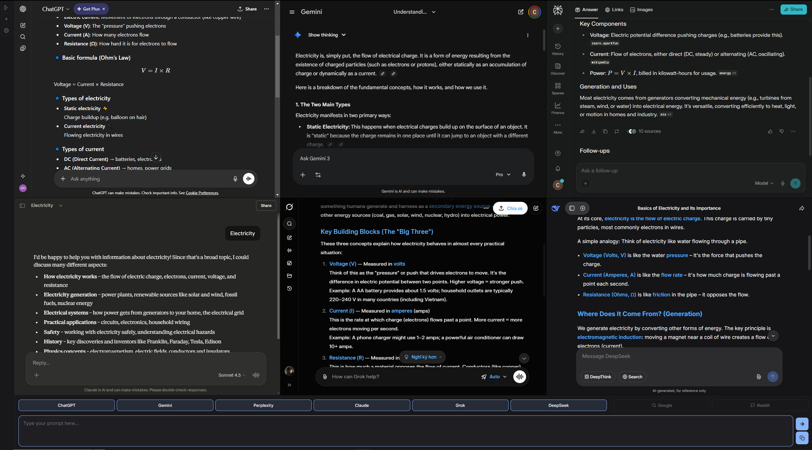
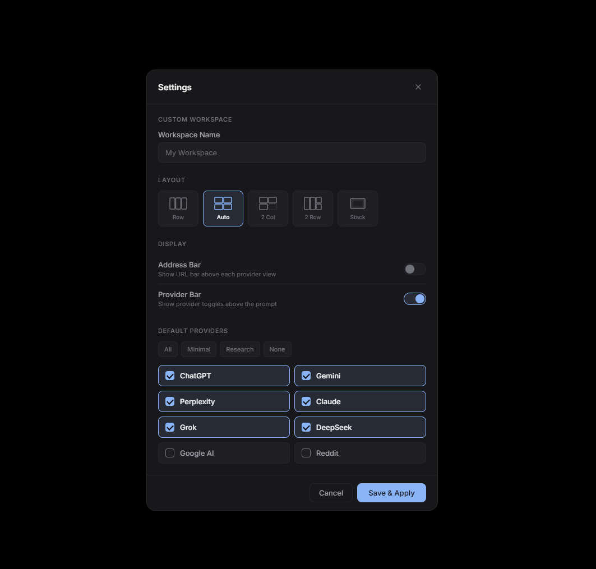

<p align="center">
  
</p>

<h1 align="center">LLM-Space</h1>

<p align="center">
  <strong>Prompt every LLM at once — from a single window.</strong><br />
  <em>Built with Electron · Windows · MIT License</em>
</p>

<p align="center">
  <a href="https://github.com/impeterwayne/llm-god/releases"></a>
  <a href="LICENSE"></a>
</p>

---



## About

LLM-Space is a desktop app that lets you type a prompt once and broadcast it to multiple LLMs simultaneously. No more copy-pasting between tabs — compare answers side by side in real time.

**Supported Providers:** ChatGPT · Gemini · Claude · Perplexity · Grok · DeepSeek · Google AI Mode · Reddit Answers

## Installation

1. Download the latest `Setup.exe` from [**Releases**](https://github.com/impeterwayne/llm-god/releases).
2. Windows may flag the installer — click **"More info" → "Run anyway"** (code-signing pending).
3. The app launches automatically after install.

## Features

| Feature | Description |
|---------|-------------|
| **Simultaneous Prompting** | `Ctrl+Enter` sends your prompt to all active LLMs at once |
| **Global Magic Copy** | `Ctrl+Q` from anywhere grabs selected text, opens a new session, and loads it as your prompt |
| **File Drag & Drop** | Drop files into the prompt area to broadcast to all providers |
| **Copy All Answers** | One click copies every provider's response to your clipboard |
| **Session Management** | Create (`Ctrl+N`), pin, rename, switch, and delete sessions — each remembers its providers and URLs |
| **Custom Workspaces** | Choose layout (Row / Grid / 2-Col / 2-Row / Stack), toggle UI elements, set default providers |
| **Provider Toggles** | Quickly enable/disable individual providers from the bar above the prompt |
| **Stack Mode** | View one provider at a time with tab navigation (`Ctrl+Tab` / `Ctrl+Shift+Tab`) |
| **Address Bar** | Optional per-view URL bar for navigation |
| **Right-Click Menu** | Copy images, links, text; navigate back/forward/reload |
| **Dark Mode** | All providers render in dark theme automatically |

<details>
<summary><strong>Workspace Settings</strong></summary>



</details>

## Keyboard Shortcuts

| Shortcut | Action |
|----------|--------|
| `Ctrl + Enter` | Send prompt to all providers |
| `Ctrl + Q` | Global magic copy |
| `Ctrl + N` | New session |
| `Ctrl + Tab` | Next provider (Stack mode) |
| `Ctrl + Shift + Tab` | Previous provider (Stack mode) |
| `Ctrl + W` | Quit |

## Development

```bash
npm install       # Install dependencies
npm run start     # Dev mode
npm test          # Run tests
npm run make      # Package for distribution
```

## License

[MIT](LICENSE) © Nguyen Khac Cuong
